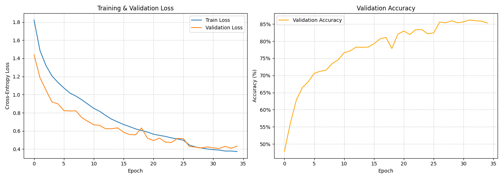

# High-Accuracy CNN for CIFAR-10 Image Classification

### 🚀 [View the Interactive Project Infographic Here!](index.html)


---

## Project Overview

This project documents the end-to-end process of building, training, and optimizing a Convolutional Neural Network (CNN) to achieve high accuracy on the CIFAR-10 image classification task. Through a series of iterative experiments, we improved a baseline model's performance from **~60% to a final test accuracy of 86.39%**.

This repository showcases a professional machine learning workflow, including:
-   A robust, reproducible training pipeline with a validation set.
-   Techniques to combat overfitting like Data Augmentation, Dropout, and Weight Decay.
-   Advanced architectural components like Batch Normalization.
-   A sophisticated training loop with learning rate scheduling, early stopping, and best-model checkpointing.

## The Iterative Journey

Our development followed a structured, problem-solving approach:

1.  **Baseline Model:** We started with a simple CNN. It achieved ~60% accuracy but showed clear signs of overfitting.
2.  **Regularization:** We introduced Data Augmentation and Dropout to help the model generalize better. This stabilized training but hit a performance plateau, indicating the model lacked the capacity to learn more complex features.
3.  **Scaling the Architecture:** We designed a deeper, VGG-style network. This model struggled to train effectively, highlighting the need for better stabilization.
4.  **Final Optimized Model:** By adding **Batch Normalization** to the deep architecture, we enabled stable and efficient training, leading to our final high-performing result.

## Final Model Performance

The final model demonstrates a significant leap in performance, successfully learning to distinguish even between visually similar classes.

-   **Final Test Accuracy:** **86.39%**
-   **Best Validation Accuracy:** **86.20%**

### Training History
The training and validation loss curves show a healthy learning process, with the validation loss closely tracking the training loss, indicating that overfitting was successfully controlled.



### Confusion Matrix
The confusion matrix highlights the model's strong performance. It is highly accurate with distinct classes like `automobile`, `ship`, and `truck`. While `cat` remains the most challenging class, its accuracy is vastly improved compared to earlier models.


## How to Run This Project

### 1. Setup

Clone the repository and set up a Python virtual environment.

```bash
git clone [https://github.com/your-username/your-repo-name.git](https://github.com/your-username/your-repo-name.git)
cd your-repo-name
python -m venv .venv
source .venv/bin/activate  # On Windows, use `.venv\Scripts\activate`

```
### 2. Install Dependencies

Install all the required libraries from the requirements.txt file.

```bash
pip install -r requirements.txt

```
### 3. Run the Notebook
Launch Jupyter Notebook or open the project in an IDE like VS Code that supports notebooks.
Open the .ipynb file and run the cells sequentially to reproduce the training and evaluation process. The notebook is pre-configured to use a GPU if one is available.
